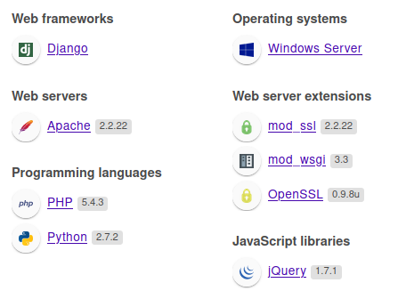

# 🔰 10.200.81.150 | Linux


~~**Port Forwarding `80/http`**~~\
~~``~~Tried that using Chisel Local Port Forward but didn't work!


#### Use _<mark style="color:green;">**`sshuttle`**</mark>** ****and connect host to the local network**_

_****_.png>)_****_

## <mark style="color:purple;background-color:green;">\_\_Enumeration\_\_</mark>

<details>

<summary><mark style="color:purple;">NMAP</mark></summary>

```
Nmap scan report for 10.200.81.150
Host is up (0.00012s latency).

PORT     STATE SERVICE       VERSION
80/tcp   open  http          Apache httpd 2.2.22 ((Win32) mod_ssl/2.2.22 OpenSSL/0.9.8u mod_wsgi/3.3 Python/2.7.2 PHP/5.4.3)
|_http-title: Page not found at /
|_http-server-header: Apache/2.2.22 (Win32) mod_ssl/2.2.22 OpenSSL/0.9.8u mod_wsgi/3.3 Python/2.7.2 PHP/5.4.3
3389/tcp open  ms-wbt-server Microsoft Terminal Services
| rdp-ntlm-info: 
|   Target_Name: GIT-SERV
|   NetBIOS_Domain_Name: GIT-SERV
|   NetBIOS_Computer_Name: GIT-SERV
|   DNS_Domain_Name: git-serv
|   DNS_Computer_Name: git-serv
|   Product_Version: 10.0.17763
|_  System_Time: 2022-02-16T22:41:11+00:00
|_ssl-date: 2022-02-16T22:41:14+00:00; 0s from scanner time.
| ssl-cert: Subject: commonName=git-serv
| Not valid before: 2022-02-15T10:50:13
|_Not valid after:  2022-08-17T10:50:13
5985/tcp open  http          Microsoft HTTPAPI httpd 2.0 (SSDP/UPnP)
|_http-title: Not Found
|_http-server-header: Microsoft-HTTPAPI/2.0
Service Info: OS: Windows; CPE: cpe:/o:microsoft:windows
```


</details>

<details>

<summary>Enumeration - <mark style="color:green;">WEB SERVICES</mark></summary>

**Technologies**



**Dirsearch | Gobuster**

```yaml
/cgi-bin/
/gitstack/
/rest
```

#### Page Screenshots

.png>).png>)

</details>

## <mark style="color:red;background-color:yellow;">\_\_Exploitation\_\_</mark>

### _<mark style="color:orange;">FOOTHOLD</mark>_

### Gitstack RCE (Unauthenticated)

Exploit POC used--> [https://github.com/kacperszurek/exploits/blob/master/GitStack/gitstack\_unauthenticated\_rce.py](https://github.com/kacperszurek/exploits/blob/master/GitStack/gitstack\_unauthenticated\_rce.py)\
[https://www.exploit-db.com/exploits/43777](https://www.exploit-db.com/exploits/43777)\
.png>)\
.png>)

* We successfully created a backdoor too at `/web/exploit-dexter9.php.` We get a pseudoshell which we can convert to a fully functional reverse shell using PHP / powershell.

.png>)

### _<mark style="color:red;">GETTING SHELL</mark>_

#### Two-ways

* Given we have a fully stable shell on `.200`, we could upload a static copy of [netcat](https://github.com/andrew-d/static-binaries/raw/master/binaries/linux/x86\_64/ncat) and just catch the shell on the compromised host.
* We could set up a socat/chisel relay on .200 to forward a shell back to a listener on our attacker machine. _<mark style="color:yellow;">\[PRACTICE]</mark>_

### Setting up a relay to get a shell


CentOS uses an always-on wrapper around the IPTables firewall called "`firewalld`". By default, this firewall is extremely restrictive, only allowing access to SSH and anything else the sysadmin has specified. Before capturing (or relaying) shells, we need to open our desired port in the firewall:

`firewall-cmd --zone=public --add-port PORT/tcp`


#### <mark style="color:red;background-color:yellow;">METHOD-1</mark>

<mark style="color:red;background-color:yellow;"></mark>

#### <mark style="color:red;background-color:yellow;">METHOD-2</mark>

<mark style="color:red;background-color:yellow;"></mark>

<mark style="color:red;background-color:yellow;"></mark>

### _<mark style="color:red;">PRIV-ESC</mark>_

__\
__

__
